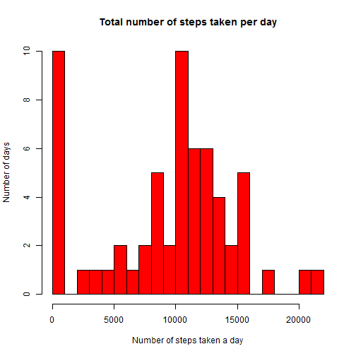
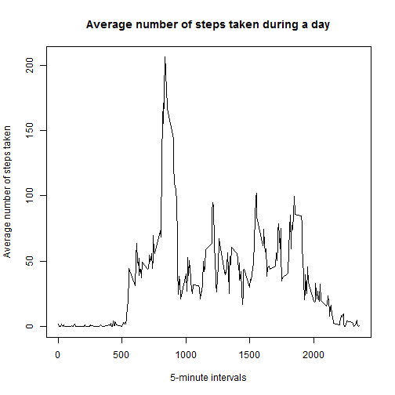
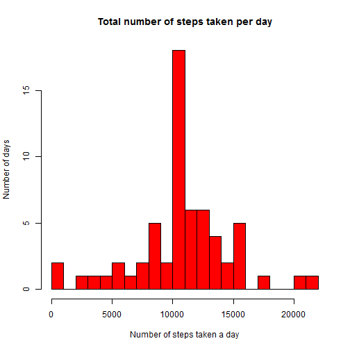
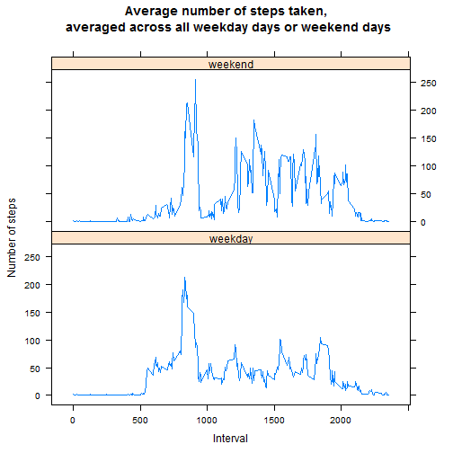

# Reproducible Research: Peer Assessment 1
by Gabor Oltyan

## Introduction
It is now possible to collect a large amount of data about personal movement using activity monitoring devices such as a Fitbit, Nike Fuelband, or Jawbone Up. These type of devices are part of the “quantified self” movement – a group of enthusiasts who take measurements about themselves regularly to improve their health, to find patterns in their behavior, or because they are tech geeks. But these data remain under-utilized both because the raw data are hard to obtain and there is a lack of statistical methods and software for processing and interpreting the data.

This assignment makes use of data from a personal activity monitoring device. This device collects data at 5 minute intervals through out the day. The data consists of two months of data from an anonymous individual collected during the months of October and November, 2012 and include the number of steps taken in 5 minute intervals each day.

## Loading and preprocessing the data
First step is to load the data:


```r
dfActivity <- read.csv(unz("activity.zip", "activity.csv"), header=TRUE, sep=",")
```


## What is mean total number of steps taken per day?

1: I make a **histogram** of the total number of steps taken each day:


```r
dfStepsByDays <- aggregate(steps ~ date, data = dfActivity, FUN = sum, na.rm = TRUE, na.action = na.pass)

hist(dfStepsByDays$steps, main = "Total number of steps taken per day", col = "red", breaks = 20,
     xlab = "Number of steps taken a day", ylab = "Number of days")
```

 

2: I calculate and report the **mean** and **median** total number of steps taken per day:


```r
mean(dfStepsByDays$steps, na.rm = TRUE)
```

```
## [1] 9354
```

```r
median(dfStepsByDays$steps, na.rm = TRUE)
```

```
## [1] 10395
```

## What is the average daily activity pattern?

1: I make a time series plot (i.e. type = "l") of the 5-minute interval (x-axis) and the average number of steps taken, averaged across all days (y-axis)


```r
dfStepsByIntervals <- aggregate(steps ~ interval, data = dfActivity, FUN = mean, na.rm = TRUE)

plot(dfStepsByIntervals$interval, dfStepsByIntervals$steps, type = "l", main = "Average number of steps taken during a day",
     xlab = "5-minute intervals", ylab = "Average number of steps taken")
```

 

2: The following 5-minute interval, On average across all the days in the dataset, contains the maximum number of steps:


```r
dfStepsByIntervals[dfStepsByIntervals$steps == max(dfStepsByIntervals$steps, na.rm = TRUE),]$interval
```

```
## [1] 835
```

## Imputing missing values

1: I calculate and report the total number of missing values in the dataset (i.e. the total number of rows with NAs)


```r
nrow(dfActivity[is.na(dfActivity$steps),])
```

```
## [1] 2304
```

2: I've decided to apply the following a strategy for filling in all of the missing values in the dataset: I use the mean of the missing 5-minute interval (calculated on the whole dataset) for filling in the missing value.

3: I create a new dataset that is equal to the original dataset but with the missing data filled in.


```r
dfActivityImp <- dfActivity

for (i in 1:nrow(dfActivityImp)) {
  if (is.na(dfActivityImp[i,1])) {
    dfActivityImp[i,1] <- dfStepsByIntervals[(dfStepsByIntervals$interval == dfActivityImp[i,3]),]$steps
  }
}
```

4: I make a **histogram** of the total number of steps taken each day and calculate and report the **mean** and **median** total number of steps taken per day.


```r
dfStepsByDaysImp <- aggregate(steps ~ date, data = dfActivityImp, FUN = sum)

hist(dfStepsByDaysImp$steps, main = "Total number of steps taken per day", col = "red", breaks = 20,
     xlab = "Number of steps taken a day", ylab = "Number of days")
```

 

```r
mean(dfStepsByDaysImp$steps)
```

```
## [1] 10766
```

```r
median(dfStepsByDaysImp$steps)
```

```
## [1] 10766
```

Because of the selected imputing strategy the completely empty days (which originally contain only NAs) were imputed with the average number of steps taken in the intervals of the average day. Therefore
- the histogram has been changed: the originally bimodal histogram became unimodal.
- the mean and the median has also been changed: the mean and the median are the same.

## Are there differences in activity patterns between weekdays and weekends?

1: I create a new factor variable in the dataset with two levels – “weekday” and “weekend” indicating whether a given date is a weekday or weekend day.


```r
dfActivityImp <- transform(dfActivityImp, 
                           daytype = as.factor(ifelse(as.POSIXlt(strptime(dfActivityImp$date, "%Y-%m-%d"))$wday %in% c(6,7), 
                                                      "weekend", "weekday")))
```

2: I make a panel plot containing a time series plot (i.e. type = "l") of the 5-minute interval (x-axis) and the average number of steps taken, averaged across all weekday days or weekend days (y-axis).


```r
dfStepsByIntAndDayType <- aggregate(steps ~ interval + daytype, data = dfActivityImp, FUN = mean)

library(lattice)
xyplot(steps ~ interval | daytype, data = dfStepsByIntAndDayType, layout = c(1,2), type = "l",
       main = "Average number of steps taken,\n averaged across all weekday days or weekend days",
       xlab = "Interval", ylab = "Number of steps")
```

 
